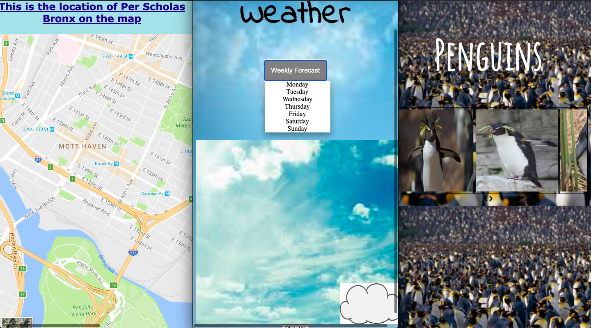

#  
# Codebridge

### Purpose

This repository contains tasks completed during the Codebridge course at Per Scholas

### Minimum Viable Product

* Usage of basic HTML, CSS, and JavaScript

### Approach Taken

* Used HTML & CSS to display elements
* Used JavaScript add animations 

### Technologies used

* **HTML** To display elements 
* **CSS** To style elements
* **JavaScript** To animate elements

### Installation Instructions
* Open HTML files in the browser

